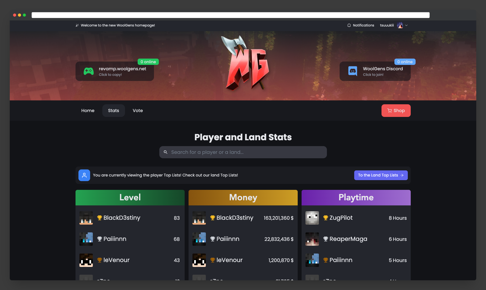

# Woolgens Websites

The is a "mono-repo" containing all website from `Woolgens.net`. 

- [X] Homepage
- [ ] Store
- [ ] Forum
- [X] Stats
- [ ] Staff

You can find the different pages under `/frontend/pages`. Please make Pull requests for all features, as without it we will easily enter merge hell! Thanks :D

## Usage

```bash
# run production build
$ docker-compose up -d

# run production build (with rebuild in case of new changes)
$ docker-compose up -d --build

# view docker logs
$ docker-compose logs -t -f

# close docker process
$ docker-compose down
```
